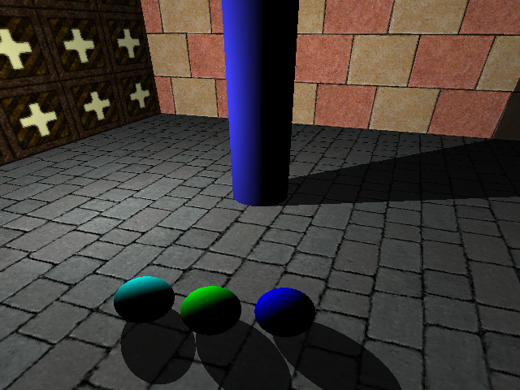

# Mrtp

A minimalistic raytracing tool to explore combining C++ with Python.

Author: Mikolaj Feliks \<<mikolaj.feliks@gmail.com>\> 
Released as open source software under the GNU GPL v3.0 license (see COPYING).

### Installation instructions

Mrtp depends on the following libraries and tools:
 * libpng-dev>=1.2
 * png++>=0.2.9
 * libeigen3-dev
 * python2.7-dev
 * cython

For reading textures and writing output images, Mrtp uses
[png++](http://www.nongnu.org/pngpp/), a C++ wrapper for libpng. 

In step 1, run *make* in the png++/ folder. This will automatically 
download and unpack all necessary files. png++ is a header library and 
does not require compilation.

In step 2, run *make* in the Mrtp/ folder. A Python library Mrtp.so 
will be generated that is ready to use in a Python script.

See the attached scripts Draw.py and Draw2.py for examples of use.

### Gallery

